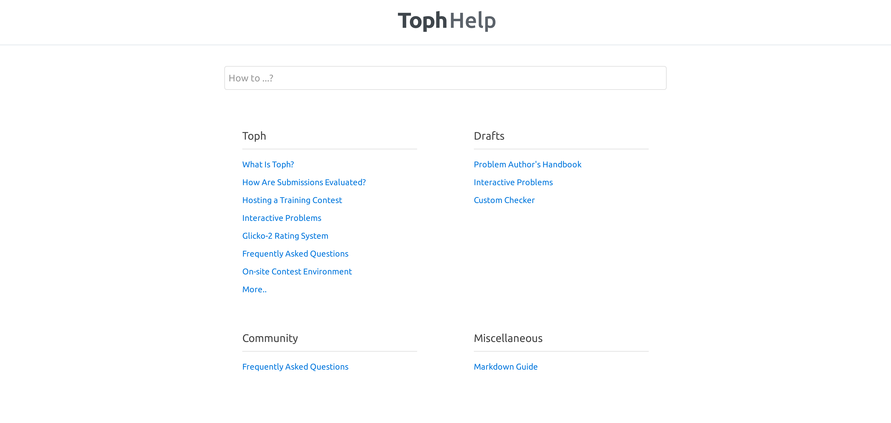

# Faqapp


Faqapp is a simple Go Markdown based knowledge base app by Furqan Software.

## Example

At [Furqan Software](https://furqansoftware.com/), Faqapp powers [Toph Help](https://help.toph.co/).



## Deploy to Heroku

[](https://heroku.com/deploy?template=https://github.com/FurqanSoftware/faqapp)

```
Username: faqapp
Password: p@assword
```
